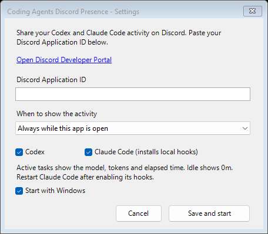

# Coding Agents Discord Presence

A Windows tray companion that shares **Codex** and **Claude Code** task activity on Discord: phase, model, token usage, and elapsed time. No Discord bot token or OpenAI/Anthropic API key is needed. The Windows EXE includes its runtime and tray icon.



## Download and setup

1. Download `CodexDiscordPresence.exe` from the [latest release](https://github.com/GrantMatas/coding-agents-discord-presence/releases/latest) and keep it in a permanent location.
2. Open the EXE. Use the setup window's link to create a [Discord application](https://discord.com/developers/applications), then paste its **Application ID**. An application named **Coding Agents** works well. Existing Application IDs continue to work.
3. Choose the visibility mode and enable Codex, Claude Code, or both. Click **Save and start**.
4. Keep Discord desktop open and enable activity sharing in its Activity Privacy settings.
5. Restart Claude Code after enabling its support so it loads the new hooks.

Double-click the tray icon to open Settings. Right-click it to view status or Quit. Launching a second copy opens Settings on the existing copy.

## Activity modes

| Mode | While a task runs | While idle |
| --- | --- | --- |
| Always while this app is open | Provider, phase, model, tokens, and task elapsed time | Idle, 0 tokens, 0m |
| Only while a task is running | Provider, phase, model, tokens, and task elapsed time | Activity disappears |

The activity describes the current phase: Thinking, Researching, Coding, Using tools, Creating visuals, or Writing. When several tasks run, the most recently active task is shown with the task count. The timer follows that task's start time and resets while idle. Quitting the companion clears its activity.

Discord controls the final card layout and activity ordering. The companion cannot force Tidal or another application to appear first.

## Claude Code support

The companion installs command hooks for Claude Code's session, prompt, tool, and stop events in `%USERPROFILE%\.claude\settings.json`. It preserves existing settings and hooks and saves an initial `.discord-presence-backup` alongside an existing settings file. Disabling Claude Code in Settings removes only this companion's hooks.

Claude's model and reported usage are read from its local transcript. Usage counts include input, output, cache creation, and cache read tokens, counted once per assistant message. Counts update when usage is written to the transcript. They are session totals, not billing estimates. Claude Code's [hook lifecycle](https://code.claude.com/docs/en/hooks) provides the active/idle signals. These hooks do not block or change Claude's responses.

## Codex support

Codex activity is detected from local task databases in `%USERPROFILE%\.codex`, with JSONL session fallback for older layouts. The card displays the selected thread's reported total tokens. Sessions left unfinished after a crash expire after ten minutes without an update.

The companion sends only provider, phase, model, timestamps, and usage counts to Discord. It does not send prompts, responses, project names, file paths, or transcript content. Local agent data formats may change in future versions.

## Build and troubleshoot

Building requires **Windows**, **Node.js 24+**, and **Windows PowerShell**. There are no npm dependencies.

```powershell
npm test
.\tools\Build-Exe.ps1
.\artifacts\CodexDiscordPresence.exe
.\artifacts\CodexDiscordPresence.Console.exe --status
```

The build produces a GUI EXE and a console EXE for diagnostics. `setup.ps1` launches the GUI EXE.

Settings live in `%APPDATA%\CodexDiscordPresence\config.json`. Advanced options:

| Setting | Meaning |
| --- | --- |
| `visibilityMode` | `always` (default) or `active` |
| `enableCodex`, `enableClaude` | Enable each provider; both default to true |
| `codexHome` | Override the Codex data directory; otherwise respects `CODEX_HOME` |
| `claudeHome` | Override Claude's configuration directory; otherwise respects `CLAUDE_CONFIG_DIR` |
| `imageAsset` | Codex image URL or Discord asset key; empty uses the application icon |
| `claudeImageAsset` | Optional Claude image URL or Discord asset key; defaults to the application icon |

The Codex image comes from a [public provider asset](https://github.com/backnotprop/orchestrator/blob/main/assets/providers/codex-icon-dark.png); a copy is embedded for the tray. This is an independent companion. Codex, Claude Code, and Discord names and product marks belong to their respective owners.
